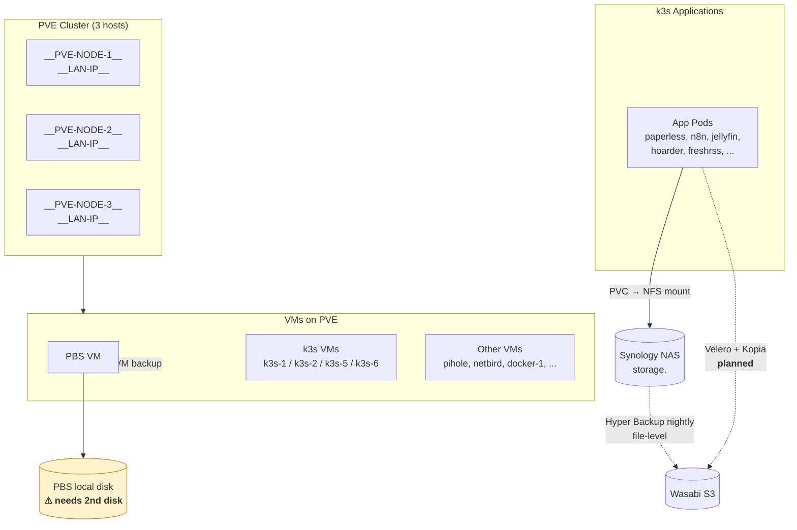

# Homelab Infrastructure

## Backup Strategy — 3 Layers of Redundancy

### Layer 1 — VM-level (Proxmox Backup Server)

| What | Covers | Target | Status |
|---|---|---|---|
| PBS VM | All VMs (k3s nodes, services, PBS itself) | Local physical disk | ⚠ Single disk, needs mirror |

**Action item**: Add a second physical disk to the PBS VM for redundancy (ZFS mirror or equivalent).

### Layer 2 — Filesystem-level (Synology Hyper Backup)

| What | Covers | Target | Status |
|---|---|---|---|
| Synology Hyper Backup | All NFS shares on NAS — `/volume1/kub/homelab/*`, `/volume1/kubdbs/*`, `/volume1/storage/media/*` | Wasabi S3 | ✓ Nightly |

Every k3s PVC is backed by an NFS path on the NAS, so this layer catches all application data at rest.

### Layer 3 — Pod-level (Velero + Kopia)

| What | Covers | Target | Status |
|---|---|---|---|
| Velero with Kopia node-agent | App manifests + PVC data per namespace, app-consistent via hooks | Wasabi S3 | 🔜 Planned |

Enables per-app point-in-time restore through `velero restore create`. Replaces Kasten K10 (removed due to GSB license gate in v7.x).

### Layer 4 — App-level object mirror (rclone)

| What | Covers | Target | Status |
|---|---|---|---|
| `nextcloud-rclone-wasabi` CronJob | Per-user file tree at `data/<user>/files/**` | `wasabi:nextcloud-mirror` (real path keys, browsable) | ✓ Every 15 min |

### Layer 5 — Single-purpose VM Kopia repos

| What | Covers | Target | Status |
|---|---|---|---|
| app-vm Kopia | `/opt/app-vm/configs`, `/opt/app-vm/PASTES`, `/opt/app-vm/DATA_KVROCKS` | `s3://<your-s3-bucket>/vm/app-vm/` (separate prefix from `dock/dockN/`) | ✓ Daily 03:30 |

Same machinery as docker-1/docker-2 (`terraform/dock_nodes/cloud-init/kopia-backup.sh`),
just different `KOPIA_PATHS` + `KOPIA_S3_PREFIX`. Read-only browse UI at
`https://kopia-app-vm.<your-domain>`.

Layer 2/3 require Postgres + cluster to make sense of restored bytes. Layer 4 is **standalone-restorable**: pull from Wasabi to any disk and the file tree is usable as-is. Added 2026-05-04 with the filesystem-primary cutover (replaced MinIO + the prior `mc mirror` cronjob, which mirrored opaque `urn:oid` blobs).

## Component Inventory

### Hypervisors
- **PVE cluster**: __PVE-NODE-1__/__PVE-NODE-2__/__PVE-NODE-3__ @ <your-hv-subnet>.10-12 (example: __LAN-IP__) (Proxmox VE 8.4)

### VMs
- **PBS**: Proxmox Backup Server — sink for all VM backups
- **k3s control plane**: k3s-1 @ <your-svc-subnet>.41 (example) (master, v1.34.2)
- **k3s workers**: k3s-2 @ <your-svc-subnet>.42, k3s-5 @ <your-svc-subnet>.45, k3s-6 @ <your-svc-subnet>.46 (examples) (all v1.32.3 — version drift to monitor)
- **Other services**: docker-1 (<your-svc-subnet>.40, Docker host), pihole1 (<your-svc-subnet>.20), netbird-exit-1/2 (<your-svc-subnet>.48/49)
- **Single-purpose app VMs**: app-vm (<your-svc-subnet>.70, AIL Framework — bare-metal upstream installer, no docker; managed via `terraform/app-vm-node/`)

### Storage
- **Synology NAS** — `storage.<your-domain>` / <your-storage-ip>
  - `/volume1/kub/homelab/*` — app config and small data (NFS)
  - `/volume1/kubdbs/*` — database volumes (NFS)
  - `/volume1/storage/media/*` — media libraries (jellyfin, paperless docs)
- **PBS local disk** — Proxmox backup target
- **Wasabi S3** — off-site backup target (Layers 2 and 3)

### k3s Storage Classes (in-cluster)
| Class | Provisioner | Used for |
|---|---|---|
| `storage` | nfs.csi.k8s.io (static PVs) | App config/data |
| `storage-db` | nfs.csi.k8s.io (static PVs) | Database volumes |
| `monitoring` | nfs.csi.k8s.io | Prometheus, Grafana, Alertmanager |
| `jellyfin` | nfs.csi.k8s.io (dynamic) | Jellyfin config |
| `local-path` | rancher.io/local-path | Ephemeral (it-tools) |

All NFS-backed PVs are **static** (hand-written `spec.nfs.path/server`) — they bypass the CSI driver for provisioning, which is why Kasten couldn't snapshot them. Velero's Kopia uploader works on any PVC type so it sidesteps this entirely.

### Flux Helm machinery

As of 2026-04-29, flux-source has its first `HelmRepository` and `HelmRelease`
resources (Loki + Promtail). Future Helm-shipped apps can reuse the existing
HelmRepository in `flux-system` ns instead of declaring their own:

| Repository | URL | Used by |
|---|---|---|
| `grafana` | https://grafana.github.io/helm-charts | `loki`, `promtail` (and future Grafana-stack apps: Alloy, Tempo, Mimir, ...) |

### Flux-managed app workloads (per-app subdirs under `clusters/default/`)

| App                  | Hostname                | NAS path                            | Notes |
|----------------------|-------------------------|-------------------------------------|-------|
| uptime-kuma          | uptime.<your-domain>       | `/volume1/kub/homelab/uptime-kuma`  | RWO 2Gi, runs as 1000:1000 |
| netalert (NetAlertX) | netalert.<your-domain>     | `/volume1/kub/homelab/netalert`     | RWO 5Gi, runs as 20211:20211, **hostNetwork: true** pinned to k3s-1 (LAN ARP/mDNS discovery) |
| loki                 | (internal-only)         | `/volume1/kub/homelab/loki`         | RWO 50Gi, runs as 10001:10001, monolithic mode (chart `loki` 7.0.0 / app 3.6.7), 14d retention. **NO IngressRoute / NO LoadBalancer** — Grafana queries via in-cluster ClusterIP `loki.loki.svc.cluster.local:3100`. First flux HelmRelease in this repo. Pinned to k3s-1 via `nodeSelector` (k3s-7 currently fails to mount the loki NFS path). |
| promtail             | (DaemonSet, no host)    | (no PVC)                            | Chart `promtail` 6.17.1 / app 3.5.1. Runs on every k3s node incl. control-plane via standard CP tolerations. Ships pod logs + journald → Loki at `loki.loki.svc.cluster.local:3100`. ServiceMonitor labelled `release=prometheus`. |

Other apps (`freshrss`, `grafana`, `n8n`, `paperless`, ...) are
IngressRoute-only under flux today; their workloads are still
`kubectl apply`-managed and are tracked in the broader homelab GitOps
migration scope. See bastion backlog `999.2 — homelab GitOps migration`.

### External-IP-backend bundles (Service + EndpointSlice + IngressRoute)

These routes expose hosts that run **outside** the k3s cluster. Each
bundle is one YAML file at `clusters/default/<host>.yaml` containing a
headless Service, a static EndpointSlice pointing to the external IP(s),
and an IngressRoute on the `websecure` entrypoint. Traefik terminates
TLS with the `*.<your-domain>` Let's Encrypt wildcard so every backend gets
a valid cert without per-host ACME. For HTTPS backends,
`serversTransport: lan-self-signed` skips upstream cert verification on
internal self-signed certs.

**Why this section exists:** internal scans / `dig` / nmap on these
hostnames return `<k3s-vip>` (the Traefik VIP), not the real backend.
That's by design — the alternative is per-host cert distribution to
preserve TLS, which isn't worth the maintenance surface. When you need
to know what's actually behind a hostname (recon, troubleshooting,
emergency direct access if Traefik is down), this table is the source
of truth.

> **Note:** All hostnames follow the pattern `<app>.<your-domain>`. IP addresses shown
> are example values from the operator's LAN topology — replace with your own.

#### Single dedicated backend

Each host has one IP and runs only that service — no Traefik
hostname-routing required. If Traefik is down, you can hit the host
directly at the listed `<ip>:<port>` (with whatever cert that host
serves itself, which is usually self-signed).

| Hostname | Real backend | Upstream |
|---|---|---|
| __PVE-NODE-1__.<your-domain> | __PVE-NODE-1__ — <your-hv-subnet>.10 (example) | 8006 https |
| __PVE-NODE-2__.<your-domain> | __PVE-NODE-2__ — <your-hv-subnet>.11 (example) | 8006 https |
| __PVE-NODE-3__.<your-domain> | __PVE-NODE-3__ — <your-hv-subnet>.12 (example) | 8006 https |
| __PVE-MGMT-1__.<your-domain> | __PVE-NODE-1__ BMC — <your-mgmt-subnet>.14 (example) | 443 https |
| backup-host.<your-domain> | PBS — <your-svc-subnet>.19 (example) | 8007 https |
| storage.<your-domain> + synology.<your-domain> | Synology DSM — <your-storage-ip> | 5001 https |
| dns.<your-domain> | pihole1 — <your-svc-subnet>.20 (example) | 80 http |
| dns2.<your-domain> | pihole2 — <your-svc-subnet>.21 (example) | 80 http |
| sw.<your-domain> | network switch — <your-mgmt-subnet>.3 (example) | 80 http |
| pa.<your-domain> | pa device — <your-mgmt-subnet>.4 (example) | 443 https |
| app-vm.<your-domain> | app-vm — <your-svc-subnet>.70 (example) | 7000 https (lan-self-signed) |
| kopia-app-vm.<your-domain> | app-vm systemd `kopia-server.service` — <your-svc-subnet>.70 (example) | 51515 http (basic auth) |

#### docker-1 multi-tenant

All seven hostnames terminate at Traefik, which routes to the right
docker container on docker-1 by host header. Direct access bypassing
Traefik would require either a reverse proxy on docker-1 itself or
per-service host ports. The upstream port column is the docker-published
host port — usable for emergency access via `https://<your-svc-subnet>.40:<port>`
(self-signed where applicable).

| Hostname | Container | Upstream |
|---|---|---|
| checkmk.<your-domain> | docker-1 (<your-svc-subnet>.40) `checkmk` | 5000 http |
| cryptpad.<your-domain> | docker-1 (<your-svc-subnet>.40) `cryptpad` | 3000 http |
| komodo.<your-domain> | docker-1 (<your-svc-subnet>.40) `komodo-core-1` | 9120 http |
| kopia-docker-1.<your-domain> | docker-1 (<your-svc-subnet>.40) systemd `kopia-server.service` | 51515 http (basic auth) |
| kopia-docker-2.<your-domain> | docker-2 (<your-svc-subnet>.39) systemd `kopia-server.service` | 51515 http (basic auth) |
| lacus.<your-domain> | docker-2 (<your-svc-subnet>.39) `lacus` | 7100 http (capture API) |
| maltrail.<your-domain> | docker-1 (<your-svc-subnet>.40) `maltrail-server` | 8338 http |
| openvas.<your-domain> | docker-1 (<your-svc-subnet>.40) `greenbone-...-nginx-1` | 9443 https (lan-self-signed) |
| torrents.<your-domain> | docker-1 (<your-svc-subnet>.40) `qbittorrent` via `gluetun` | 8085 http |
| wazuh.<your-domain> | docker-1 (<your-svc-subnet>.40) `single-node-wazuh.dashboard-1` | 5601 https (lan-self-signed) |

#### Multi-IP load-balanced

Traefik fans out across multiple backends. There's no single "real IP"
to broadcast in DNS — load balancing is the point.

| Hostname | Real backends | Upstream |
|---|---|---|
| netdata.<your-domain> | every node — <your-svc-subnet>.40/.41/.42/.45/.46/.47 (example) | 19999 http |
| legacy-vm.<your-domain> | docker-1 (<your-svc-subnet>.40) + docker-2 (<your-svc-subnet>.39) | 6901 https (lan-self-signed) |

#### Adding a new external-IP route

When you add a new `clusters/default/<host>.yaml` with the
Service+EndpointSlice+IngressRoute pattern, add a row to the appropriate
table above. Without it, future-you (or the next person scanning the
LAN) can't tell what's behind the hostname — DNS only ever points at
the Traefik VIP.

#### Retired apps

- **Fing** (260429-k88) — replaced by NetAlertX 2026-04-29 after
  CrashLoopBackOff on the agent's account-linking flow. NAS path
  `/volume1/kub/homelab/fing` retains data; operator wipes via DSM
  if/when desired.

## Known Constraints

- **k3s-6 lacks `nfs-common`** — pods using NFS PVs fail to mount here. Pin NFS-dependent workloads to `k3s-2` via `nodeSelector: { kubernetes.io/hostname: k3s-2 }` (pattern used by jellyfin and paperless).
- **k3s version drift**: k3s-1 on v1.34.2, others on v1.32.3. No active issues, but upgrade path needed.
- **DNS gotcha**: every external-IP-backend hostname resolves to the Traefik VIP (`<k3s-vip>`) on internal DNS, not the real backend. This is intentional — Traefik serves the LE wildcard cert. For the actual backend behind any hostname (recon, troubleshooting, emergency direct access), see the *External-IP-backend bundles* section above.
- **Terraform coverage**: only `k3s-5` is managed by `terraform/k3s_nodes/`. k3s-4 was manually provisioned and got decommissioned 2026-04-22 (chronic flapping).
