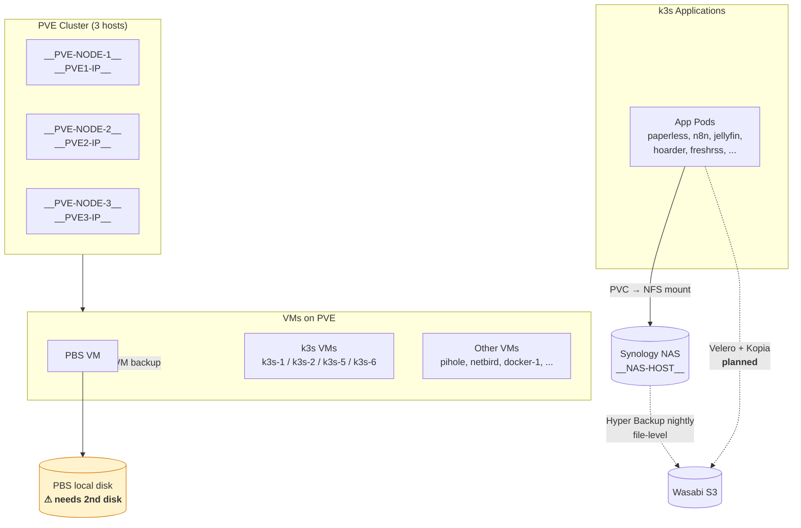

# Homelab Infrastructure

## Backup Strategy — 3 Layers of Redundancy

### Layer 1 — VM-level (Proxmox Backup Server)

| What | Covers | Target | Status |
|---|---|---|---|
| PBS VM | All VMs (k3s nodes, services, PBS itself) | Local physical disk | ⚠ Single disk, needs mirror |

**Action item**: Add a second physical disk to the PBS VM for redundancy (ZFS mirror or equivalent).

### Layer 2 — Filesystem-level (Synology Hyper Backup)

| What | Covers | Target | Status |
|---|---|---|---|
| Synology Hyper Backup | All NFS shares on NAS — `/volume1/kub/homelab/*`, `/volume1/kubdbs/*`, `/volume1/storage/media/*` | Wasabi S3 | ✓ Nightly |

Every k3s PVC is backed by an NFS path on the NAS, so this layer catches all application data at rest.

### Layer 3 — Pod-level (Velero + Kopia)

| What | Covers | Target | Status |
|---|---|---|---|
| Velero with Kopia node-agent | App manifests + PVC data per namespace, app-consistent via hooks | Wasabi S3 | 🔜 Planned |

Enables per-app point-in-time restore through `velero restore create`. Replaces Kasten K10 (removed due to GSB license gate in v7.x).

## Component Inventory

### Hypervisors
- **PVE cluster**: __PVE-NODE-1__/__PVE-NODE-2__/__PVE-NODE-3__ @ __PVE1-IP__-12 (Proxmox VE 8.4)

### VMs
- **PBS**: Proxmox Backup Server — sink for all VM backups
- **k3s control plane**: k3s-1 @ __K3S-API-IP__ (master, v1.34.2)
- **k3s workers**: k3s-2 @ __LAN-IP__, k3s-5 @ __LAN-IP__, k3s-6 @ __LAN-IP__ (all v1.32.3 — version drift to monitor)
- **Other services**: docker-1 (__LAN-IP__, Docker host), pihole1 (__PIHOLE1-IP__), netbird-exit-1/2 (__LAN-IP__/49)

### Storage
- **Synology NAS** — `__NAS-HOST__` / __NAS-IP__
  - `/volume1/kub/homelab/*` — app config and small data (NFS)
  - `/volume1/kubdbs/*` — database volumes (NFS)
  - `/volume1/storage/media/*` — media libraries (jellyfin, paperless docs)
- **PBS local disk** — Proxmox backup target
- **Wasabi S3** — off-site backup target (Layers 2 and 3)

### k3s Storage Classes (in-cluster)
| Class | Provisioner | Used for |
|---|---|---|
| `storage` | nfs.csi.k8s.io (static PVs) | App config/data |
| `storage-db` | nfs.csi.k8s.io (static PVs) | Database volumes |
| `monitoring` | nfs.csi.k8s.io | Prometheus, Grafana, Alertmanager |
| `jellyfin` | nfs.csi.k8s.io (dynamic) | Jellyfin config |
| `local-path` | rancher.io/local-path | Ephemeral (it-tools) |

All NFS-backed PVs are **static** (hand-written `spec.nfs.path/server`) — they bypass the CSI driver for provisioning, which is why Kasten couldn't snapshot them. Velero's Kopia uploader works on any PVC type so it sidesteps this entirely.

### Flux-managed app workloads (per-app subdirs under `clusters/default/`)

| App                  | Hostname                | NAS path                            | Notes |
|----------------------|-------------------------|-------------------------------------|-------|
| uptime-kuma          | uptime.__BASE-DOMAIN__       | `/volume1/kub/homelab/uptime-kuma`  | RWO 2Gi, runs as 1000:1000 |
| netalert (NetAlertX) | netalert.__BASE-DOMAIN__     | `/volume1/kub/homelab/netalert`     | RWO 5Gi, runs as 20211:20211, **hostNetwork: true** pinned to k3s-1 (LAN ARP/mDNS discovery) |

Other apps (`freshrss`, `grafana`, `n8n`, `paperless`, ...) are
IngressRoute-only under flux today; their workloads are still
`kubectl apply`-managed and are tracked in the broader homelab GitOps
migration scope. See bastion backlog `999.2 — homelab GitOps migration`.

#### Retired apps

- **Fing** (260429-k88) — replaced by NetAlertX 2026-04-29 after
  CrashLoopBackOff on the agent's account-linking flow. NAS path
  `/volume1/kub/homelab/fing` retains data; operator wipes via DSM
  if/when desired.

## Known Constraints

- **k3s-6 lacks `nfs-common`** — pods using NFS PVs fail to mount here. Pin NFS-dependent workloads to `k3s-2` via `nodeSelector: { kubernetes.io/hostname: k3s-2 }` (pattern used by jellyfin and paperless).
- **k3s version drift**: k3s-1 on v1.34.2, others on v1.32.3. No active issues, but upgrade path needed.
- **DNS gotcha**: `__PVE-NODE-3__.__BASE-DOMAIN__` resolves to k8s node IPs (incorrect). Always use raw PVE IPs `__PVE1-IP__/11/12`.
- **Terraform coverage**: only `k3s-5` is managed by `terraform/k3s_nodes/`. k3s-4 was manually provisioned and got decommissioned 2026-04-22 (chronic flapping).
