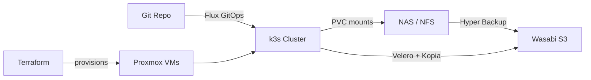

# homelab

A GitOps-managed k3s + Proxmox homelab used as a real-world IaC sandbox. Three Proxmox
VE nodes host a k3s cluster, two Docker Compose hosts, and supporting infrastructure.
Flux reconciles `clusters/default/` on every push; Terraform provisions VMs; Ansible
configures nodes. Everything a fork operator needs to replicate on their own domain is in
this repo.

## Architecture

The Proxmox cluster hosts k3s worker VMs and Docker Compose hosts. Flux watches this Git
repo and applies `clusters/default/` to the cluster continuously. The NAS provides
NFS-backed PersistentVolume storage for stateful workloads. Off-site backups flow to
Wasabi S3 via Hyper Backup at the NAS level and via Velero + Kopia at the pod level.

See [INFRASTRUCTURE.md](INFRASTRUCTURE.md) for the full topology diagram and component
inventory.

## Prerequisites

### Hardware

| Component | Notes |
|-----------|-------|
| Proxmox VE cluster (3 nodes recommended) | Single-node works with manifest adjustments |
| NAS with NFS exports | Synology used here; any NFS server works |
| Domain name | All IngressRoutes and cert-manager derive from `BASE_DOMAIN` |
| S3-compatible storage (Wasabi recommended) | Required for off-site backups (Velero + Hyper Backup) |

### Accounts

| Service | Purpose | Required |
|---------|---------|---------|
| GitHub | Flux GitOps source | Yes |
| Cloudflare (or other DNS provider) | ACME DNS-01 challenge for wildcard cert | Yes |
| Wasabi (or other S3-compatible) | Off-site backup target | Yes |

### Tools

| Tool | Purpose | Min Version |
|------|---------|-------------|
| tofu (OpenTofu) | VM provisioning via Terraform modules | 1.6+ |
| ansible | k3s installation and node configuration | 2.15+ |
| kubectl | Cluster management and out-of-band secret application | 1.28+ |
| flux CLI | GitOps bootstrap and monitoring | 2.x |
| kustomize | Manifest rendering and drift verification | 5.x |
| gh CLI | Repo and release management | 2.x |

## Getting Started

Order of operations for a fork-and-replicate:

1. Fork this repo and clone your fork
2. Copy `.env.example` → `.env`; fill in all 21 variables (see [REPLICATE.md](REPLICATE.md) for a key-by-key walkthrough)
3. Provision infrastructure: `tofu apply` in each Terraform module, then Ansible for k3s
4. Apply the cluster-vars ConfigMap to your cluster (off-tree real-values file, gitignored)
5. Bootstrap Flux against your fork
6. Apply out-of-band Kubernetes Secrets (see [SECRETS.md](SECRETS.md))
7. Watch `flux get kustomization flux-system --watch` until reconciliation succeeds

Full step-by-step walkthrough: **[REPLICATE.md](REPLICATE.md)**

## Key Variables

The 21 variables in `.env.example` and `flux-system/cluster-vars.example.yaml` are the
complete fork-operator surface. The most important ones to set first:

| Variable | Purpose |
|----------|---------|
| `BASE_DOMAIN` | Your domain; all IngressRoutes and cert-manager derive from this |
| `NAS_HOST` / `NAS_IP` | Your NFS server hostname and IP |
| `S3_BUCKET` | Your Wasabi/S3 bucket name for off-site backups |
| `K3S_VIP` | MetalLB VIP assigned to the Traefik LoadBalancer Service |
| `PVE_NODE_1/2/3` | Proxmox cluster node hostnames |

Full variable reference with descriptions and example values: [REPLICATE.md](REPLICATE.md)

## Documentation

| Doc | Purpose |
|-----|---------|
| [REPLICATE.md](REPLICATE.md) | Step-by-step: fork → reconciling cluster |
| [SECRETS.md](SECRETS.md) | Every Kubernetes Secret: apply pattern, key sources, template files |
| [INFRASTRUCTURE.md](INFRASTRUCTURE.md) | Homelab topology, backup strategy, component inventory |
| [docs/FLUX-SOURCE.md](docs/FLUX-SOURCE.md) | Internal operator notes: migrated apps, Helm pattern, repo conventions |

## License

MIT — see [LICENSE](LICENSE)
