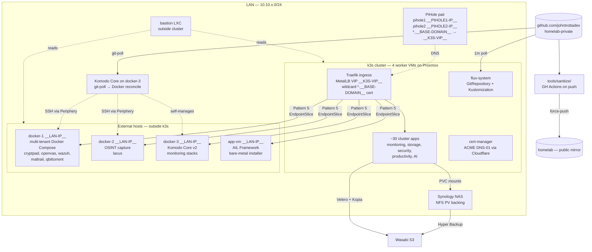
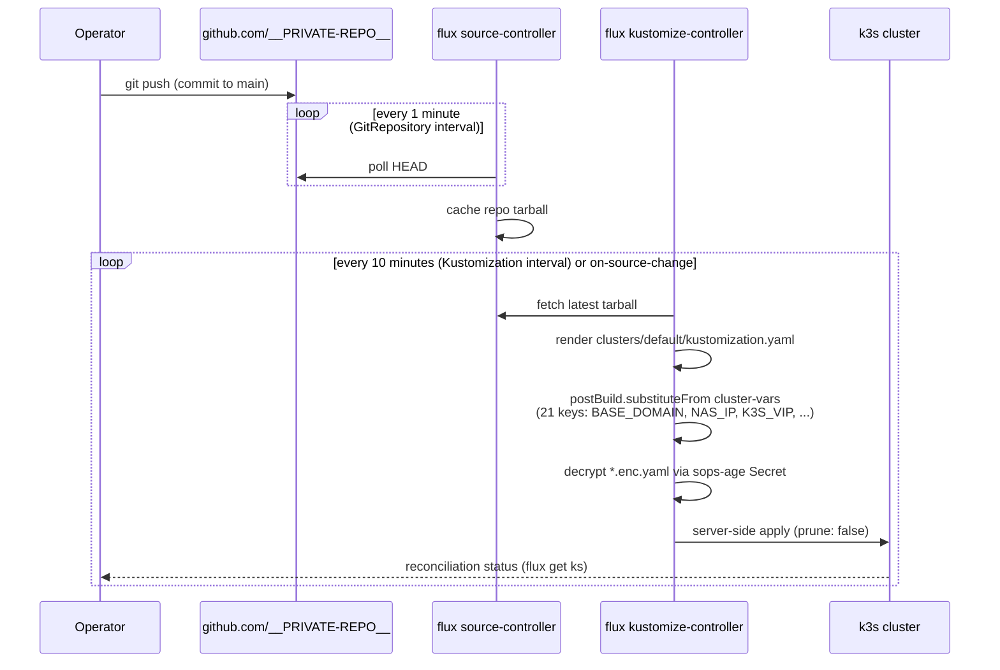
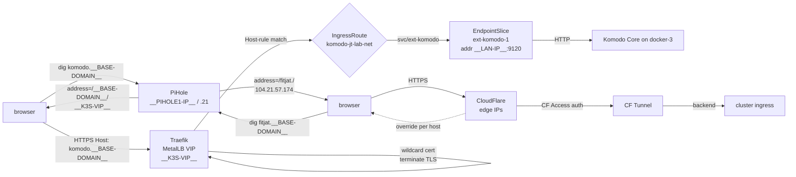

# homelab

> **This is a sanitized public mirror.** The source of truth lives in a private repository (`__PRIVATE-REPO__`) and is force-pushed here on every change by `tools/sanitize/`. Issues, pull requests, or comments opened on this mirror are not monitored. Forks are welcome; the mirror does not accept upstream contributions.

A GitOps-managed k3s + Proxmox homelab used as a real-world IaC sandbox. Three Proxmox VE nodes host a k3s cluster, three Docker Compose hosts run external workloads, and one bare-metal VM runs an OSINT framework that can't be containerized. Flux reconciles `clusters/default/` continuously; Komodo Core reconciles the Docker hosts in parallel; Terraform provisions VMs; Ansible configures nodes. The companion repo [bastion](https://github.com/johntrottadev/opsman) is the AI ops manager that audits this environment from outside the cluster.

**Core principle:** *a real environment to learn and break things in.* Reliability matters insofar as breaking the lab teaches; perfect uptime is not the goal. Every design choice is graded on whether it makes the next failure more legible, not whether it prevents the failure.

---

## Table of Contents

- [Architecture at a Glance](#architecture-at-a-glance)
- [The Two-Repo Pattern](#the-two-repo-pattern)
- [How a Commit Becomes Running State](#how-a-commit-becomes-running-state)
- [DNS and Ingress](#dns-and-ingress)
- [Pattern 5: External-IP-Backend Bundles](#pattern-5-external-ip-backend-bundles)
- [The External Hosts](#the-external-hosts)
- [Secrets and Config Management](#secrets-and-config-management)
- [Monitoring Stack](#monitoring-stack)
- [Renovate and Image Pinning](#renovate-and-image-pinning)
- [The Sanitize Pipeline](#the-sanitize-pipeline)
- [Design Decisions](#design-decisions)
- [Tradeoffs and Known Limitations](#tradeoffs-and-known-limitations)
- [Recent Activity](#recent-activity)
- [Fork and Replicate](#fork-and-replicate)
- [Repository Layout](#repository-layout)

---

## Architecture at a Glance



Three reconcilers, one repo. Flux reads `clusters/default/` and applies to k3s. Komodo Core reads `docker-1/`, `docker-2/`, `docker-3/` and reconciles those Docker hosts. The sanitize GitHub Action reads everything, redacts according to `tools/sanitize/`, and force-pushes a public mirror. They share one source of truth and one approval process (git PR) but reconcile independent surfaces.

---

## The Two-Repo Pattern

Two repos exist because the lab's design value (forkability — someone can clone, fill in their own variables, and get a running cluster) is incompatible with operational value (real IPs, hostnames, and topology are baked into manifest comments, env examples, and the monitoring stack's alert rules).

| Repo | Role | What's in it |
|---|---|---|
| `__PRIVATE-REPO__` | source of truth | real IPs (`__LAN-IP__`, `__K3S-VIP__`), real domain (`__BASE-DOMAIN__`), real host names (`docker-1`, `__PVE-NODE-1__`, `app-vm`), private operator runbooks, the sanitize allow-list itself |
| `johntrottadev/homelab` | sanitized public mirror | placeholders (`__LAN-IP__`, `__BASE-DOMAIN__`), renamed paths (`docker-1/` → `docker-1/`), no `.planning/`, no `docs/operator/`, no `app-vm/`, push-disabled (`mirror` remote's push URL is the literal string `no-push-use-sanitize-script`) |

The mirror is rewritten by `tools/sanitize/sanitize.sh` on every push to `homelab-private/main` via `.github/workflows/sanitize.yml`. The script uses `git-filter-repo` with four cascading filters: explicit allow-list of paths, regex rewrite rules for literals, path renames, and an email-address callback. After rewrite a `topology-gate.sh` scan asserts no banned topology pattern leaked through; allow-list assertions verify `.planning/` and `tools/sanitize/` are gone. Exit codes are surgical (1 filter error, 2 topology leak, 3 allow-list assertion failure) so the workflow surfaces the right failure mode in CI logs.

The convention to follow when adding a new file: assume it ends up on the mirror unless you've added it to the allow-list as private-only. Real values pass through the sanitizer; placeholder values would corrupt the mirror.

---

## How a Commit Becomes Running State



`flux-system/gitrepository.yaml` configures the SSH URL `ssh://git@github.com/__PRIVATE-REPO__` on branch `main`, polled every 1 minute. `flux-system/kustomization.yaml` declares the root Kustomization with a 10-minute interval, server-side apply, `prune: false`, and two key behaviors: **postBuild.substituteFrom** pulls 21 keys from the `cluster-vars` resource in `flux-system` namespace (`BASE_DOMAIN`, `NAS_IP`, `K3S_VIP`, `PVE_NODE_1/2/3`, `S3_BUCKET`, …) and replaces `${VARIABLE}` placeholders throughout the rendered tree; **decryption** uses the `sops-age` Secret to decrypt any `*.enc.yaml` files inline.

`prune: false` is deliberate. The cluster was adopted in pieces from out-of-band `kubectl apply` workflows; pruning would have deleted real running state that Flux hadn't yet been taught to own. Adoption is documented in `docs/operator/` (private-only); the policy now is "add to Flux, then opt in to prune per-Kustomization when comfortable."

There is no Kustomization dependency graph — the root Kustomization is a flat list of resources. Ordering is implicit in apply order and `cluster-vars` must exist before reconcile begins. This intentional simplicity costs nothing at this scale and avoids the failure mode where one stuck Kustomization wedges the rest.

---

## DNS and Ingress



Two files own DNS on each PiHole:

- `/etc/dnsmasq.d/02-jt-lab.conf` — a single line: `address=/__BASE-DOMAIN__/__K3S-VIP__`. Wildcards every `*.__BASE-DOMAIN__` query to the Traefik VIP.
- `/etc/dnsmasq.d/03-cloudflare-tunnels.conf` — per-host overrides for hostnames routed through Cloudflare Tunnel. dnsmasq evaluates `address=` records before `server=` forwarding, so a more-specific `address=/fitjat.__BASE-DOMAIN__/<CF edge IP>` overrides the wildcard.

Traefik terminates TLS with a Let's Encrypt wildcard cert obtained via cert-manager's ACME DNS-01 challenge against Cloudflare. The wildcard cert is the reason the wildcard DNS pattern works — without it, every per-host A record would need its own cert provisioning. One cert, one terminator, every hostname.

The pattern's tradeoff: from inside the LAN, `dig komodo.__BASE-DOMAIN__` returns `__K3S-VIP__` (the Traefik VIP), not the real backend. `INFRASTRUCTURE.md` carries a "what's really behind this hostname" table for the moment Traefik is down and direct-backend access is needed. The decoupling is deliberate — it lets backends move (see the recent Komodo move below) without touching DNS.

---

## Pattern 5: External-IP-Backend Bundles

A first-class repo convention. Any service hosted *outside* the k3s cluster but reached *through* Traefik gets a triple of `Service` + `EndpointSlice` + `IngressRoute`, all in `kube-system`, all in one YAML file per service:

```yaml
# clusters/default/komodo.yaml (excerpt)
apiVersion: v1
kind: Service
metadata:
  name: ext-komodo
  namespace: kube-system
spec:
  ports:
  - { name: http, protocol: TCP, port: 9120, targetPort: 9120 }
---
apiVersion: discovery.k8s.io/v1
kind: EndpointSlice
metadata:
  name: ext-komodo-1
  namespace: kube-system
  labels:
    kubernetes.io/service-name: ext-komodo
    endpointslice.kubernetes.io/managed-by: bastion-static
addressType: IPv4
ports: [{ name: http, protocol: TCP, port: 9120 }]
endpoints:
- addresses: [__LAN-IP__]
  conditions: { ready: true, serving: true, terminating: false }
---
apiVersion: traefik.io/v1alpha1
kind: IngressRoute
metadata:
  name: komodo-jt-lab-net
  namespace: kube-system
spec:
  entryPoints: [websecure]
  routes:
  - match: Host(`komodo.${BASE_DOMAIN}`)
    kind: Rule
    services:
    - { name: ext-komodo, port: 9120, scheme: http }
```

Examples currently using this pattern:

| Hostname | Backend | Notes |
|---|---|---|
| `komodo.__BASE-DOMAIN__` | `__LAN-IP__:9120` | HTTP upstream, new control-plane host (May 2026 move from docker-1) |
| `app-vm.__BASE-DOMAIN__` | `__LAN-IP__:7000` | HTTPS upstream, self-signed cert — uses ServersTransport `lan-self-signed` to skip backend cert verification |
| `cryptpad.__BASE-DOMAIN__` | `__LAN-IP__:3000` | HTTP upstream on docker-1 |
| `openvas.__BASE-DOMAIN__` | `__LAN-IP__:9443` | HTTPS upstream with `lan-self-signed` |
| `dns.__BASE-DOMAIN__` / `dns2.__BASE-DOMAIN__` | `__PIHOLE1-IP__:80` / `__PIHOLE2-IP__:80` | the PiHole admin UIs themselves |
| `__PVE-NODE-1__.__BASE-DOMAIN__` / `backup-host.__BASE-DOMAIN__` | ProxMox / PBS management UIs | HTTPS with self-signed |

**Why this pattern beats the alternatives:**

- vs *running these services in k3s*: docker-1/docker-2/docker-3 are Docker Compose hosts orchestrated by Komodo precisely because containers like Wazuh, OpenVAS, and Komodo Core itself work better with bare-metal network access and the lighter iteration loop of `docker compose up`. Migrating them to k8s would be a refactor with no payoff at lab scale.
- vs *bare-metal TLS proxy on each host*: per-host cert distribution and renewal is operational toil — 26 services × two cert ops per renewal. The Pattern 5 bundle inherits Traefik's one wildcard cert for free.
- vs *direct port-based access* (`http://komodo.__BASE-DOMAIN__:9120`): bookmarks break, browsers warn, the operator stops trusting the lab. The whole point is bare-URL HTTPS.

When a backend moves — as Komodo did from docker-1 to the new control plane — the fix is a one-line edit to the `addresses:` in the EndpointSlice, committed and pushed. Flux reconciles in seconds. DNS doesn't change.

---

## The External Hosts

Three Docker hosts and one bare-metal VM live outside k3s on purpose. Each is documented for the question "why is this not in the cluster?"

| Host | IP | Workload | Why outside k3s |
|---|---|---|---|
| **docker-1** | `__LAN-IP__` | checkmk, cryptpad, openvas, wazuh, maltrail, qbittorrent (gluetun) | Multi-tenant Docker Compose; Wazuh and OpenVAS need raw network access that k8s NetworkPolicy makes painful. Iteration loop on these is `docker compose up`, not `kubectl apply`. |
| **docker-2** | `__LAN-IP__` | lacus (OSINT web capture) | CPU-and-I/O intensive; benefits from bare-metal scheduling without k8s overhead. |
| **docker-3** | `__LAN-IP__` | Komodo Core v2, monitoring sidecars, **new k3s/Komodo control plane host as of May 2026** | Komodo Core orchestrates docker-1/docker-2; running Komodo *on* docker-3 keeps the orchestrator's failure domain isolated from what it manages. |
| **app-vm** | `__LAN-IP__` | AIL Framework (paste/leak threat intelligence) | AIL ships a bare-metal upstream installer, not a container. Wrapping it in k8s would mean maintaining a custom Dockerfile against a project that breaks containerization regularly. |

**Komodo orchestration is the Docker-host equivalent of Flux.** Komodo Core (running on docker-3) polls `__PRIVATE-REPO__` via SSH deploy key. On each poll it reads `docker-1/komodo-stack.yaml`, `docker-2/komodo-stack.yaml`, `docker-3/komodo-stack.yaml` and reconciles their `services:` blocks against running containers on each host. Periphery v2 agents run as systemd services on each Docker host, accepting connections from Core. The result: GitOps for the Docker plane, same commit semantics as Flux for the k8s plane, two reconciler loops fed by one repo.

---

## Secrets and Config Management

Three layers, each with a different threat model:

**Layer 1 — Encrypted at rest (SOPS + age).** Manifests with secret content live as `*.enc.yaml` files committed to git, decrypted at reconcile time by kustomize-controller using a `sops-age` Secret bootstrapped out-of-band into `flux-system`. The age keypair is backed up three ways (operator's Mac SSD, NAS, password manager). Loss of the age key is unrecoverable; recovery procedure is the only piece of operator knowledge that *must* survive offline.

**Layer 2 — Out-of-band Kubernetes Secrets.** Some Secrets are applied via `kubectl apply` once during bootstrap, then referenced by manifests via `secretKeyRef`. Real-value files are `.gitignore`'d; only `.template` siblings are committed. The pre-commit hook `tools/pre-commit/ensure-sops-encrypted.sh` blocks any commit containing `apiVersion: v1\nkind: Secret` outside the `.enc.yaml` convention.

**Layer 3 — The `cluster-vars` ConfigMap (now Secret).** 21 keys parameterize the entire repo (`BASE_DOMAIN`, `NAS_IP`, `K3S_VIP`, `PVE_NODE_1/2/3`, `S3_BUCKET`, …). Real values live off-tree at `/Volumes/code/secrets/homelab/cluster-vars.yaml`. Substitution happens at reconcile time via Flux `postBuild.substituteFrom`. As of Phase 12 the `cluster-vars` ConfigMap is encrypted as a Secret under SOPS.

`.pre-commit-config.yaml` runs gitleaks on every staged commit; the workflow `.github/workflows/gitleaks.yml` mirrors that on PRs.

---

## Monitoring Stack

`kube-prometheus-stack` Helm release in the `monitoring` namespace, plus custom exporters and a custom rules file. Philosophy: monitor the *entire* topology — hypervisor, storage, network, workloads — as one observable system; per-host plus per-service, not just cluster-level.

| Component | Where | Purpose |
|---|---|---|
| Prometheus | `monitoring` ns, StatefulSet | metrics scraping, 15-day retention on a 100Gi NFS PV |
| Alertmanager | `monitoring` ns, StatefulSet | routes alerts to Pushover (mobile) + Slack-compatible webhook |
| Grafana | `monitoring` ns, Deployment | 13 dashboards (Velero, PVE, Palo Alto, Pi-hole, homelab front page, …) |
| Loki + Promtail | `loki` ns | log aggregation, 14-day retention, ships pod + journald |
| node-exporter | DaemonSet | per-node OS metrics |
| kube-state-metrics | Deployment | k8s object state |
| backup-host-exporter | custom | Proxmox Backup Server datastore + backup status |
| pihole-exporter | custom | DNS query metrics (multi-instance for pihole1 + pihole2) |
| snmp-exporter | custom | Synology NAS + Palo Alto firewall via SNMPv3 |
| blackbox-exporter | custom | TCP/53 probes to public DNS, synthetic resolution tests |

Custom alert rules (`clusters/default/monitoring/rules/homelab-alerts.yaml`) cover Velero backup freshness, PVE node/guest/storage health, public DNS resolution, k8s PVC pressure, PBS datastore/verification, Synology disk health, Palo Alto reachability, and — recently — OpsMan's `OpsmanDown` (10-min SLA) and `OpsmanMissedNightlySweep` (2-hour SLA). The `OpsmanDown` rule is what makes [bastion](https://github.com/johntrottadev/opsman)'s self-monitoring work: the homelab watches bastion, not the other way around.

---

## Renovate and Image Pinning

`renovate.json5` is the dependency-update policy. Two principles drive every setting:

- **`pinDigests: true`** — every container image and GitHub Action is pinned to `tag@sha256:HASH`. Tag-shifting attacks (an attacker publishes a malicious image under a popular tag like `:latest` or `:1`) become impossible against pinned digests. Deterministic rebuilds are a free side effect.
- **Rate limits** — `prConcurrentLimit: 3`, `prHourlyLimit: 1`. The first Renovate run on a 37-image repo would otherwise open 37 PRs in one minute; the limits stagger the storm so the operator can actually review them.

`enabled: false` for `^jt-lab/` package patterns excludes locally-built images (e.g. `jt-lab/legacy-vm-kasm:1.0`) that have no upstream registry to pin against. The backlog item `PIN-04` (deferred) is to publish these to ghcr.io so Renovate can track them.

`docker-compose` manager scope is extended (`fileMatch: ['(^|/)komodo-stack\\.yaml$']`) because Renovate's default file pattern misses `komodo-stack.yaml`. The github-actions manager pins each Action by SHA (e.g. `renovatebot/github-action@v46.1.14` resolved to a SHA).

---

## The Sanitize Pipeline

`tools/sanitize/sanitize.sh` runs on every push to `homelab-private/main` via `.github/workflows/sanitize.yml`. The script:

1. Clones the source repo into an ephemeral bare mirror.
2. Runs pre-rewrite hit-count scans against every regex in `expressions.txt` for a CI step-summary report.
3. Invokes `git-filter-repo` with four cascading filters:
   - `--paths-from-file paths-from-file.txt` — explicit allow-list (only listed paths survive)
   - `--replace-text expressions.txt` — 47 regex + literal rewrite rules (IPs → `__LAN-IP__`, domain → `__BASE-DOMAIN__`, host names → semantic placeholders like `docker-1` / `k3s-1` / `__PVE-NODE-1__`)
   - `--path-rename` from `path-renames.txt` (e.g. `docker-1/` → `docker-1/`)
   - `--email-callback email-callback.py` — email redaction
4. Clones the rewritten bare repo, runs `topology-gate.sh` against it to assert no banned pattern survived (real IPs, `.planning/` traces, operator runbook paths).
5. Asserts the allow-list deletions actually happened (`tools/sanitize/` and `.planning/` are gone from the rewritten tree).
6. Force-pushes the result to `johntrottadev/homelab` (the public mirror's `mirror` remote on the source side is push-disabled with literal URL `no-push-use-sanitize-script`, so manual pushes can't bypass the sanitizer).

Exit codes are surgical so CI gives the right failure message: 0 clean, 1 filter-repo error, 2 topology-gate failure, 3 allow-list assertion failure.

---

## Design Decisions

Each subsection names what was rejected and why.

### Why Flux (and not ArgoCD)

Flux's controllers are pure Kubernetes CRDs — no separate dashboard, no separate auth surface, no RBAC for a UI to be locked down. ArgoCD ships excellent UX, which is exactly the temptation. **ArgoCD's UI value collapses at N=1 operator**: every action that would be a click is `git commit` here, the git history already is the audit log, and `flux logs -f` plus `flux get ks` cover what Argo's UI shows. The value of the UI scales with team size; team size here is 1. Server-side apply with `prune: false` was crucial during adoption — it let Flux coexist with pre-existing out-of-band resources without churn.

### Why k3s (and not full kubeadm-built k8s)

k3s is a single binary under 60 MB that ships a fully CNCF-conformant k8s plus kube-vip and Traefik. For a homelab with one operator and four worker VMs, the production bootstrap process for kubeadm (etcd HA, cert generation, kubelet config drift) is pure cost for zero benefit. k3s does the same thing with `curl -sfL https://get.k3s.io | sh -`. If this lab ever needed multi-master HA, kubeadm would re-enter the conversation; until then k3s is correct, not "good enough."

### Why Traefik (and not nginx-ingress)

Traefik exposes a typed CRD surface (`IngressRoute`, `Middleware`, `ServersTransport`). nginx-ingress configures behavior via Ingress annotations that are stringly-typed and version-coupled. The `ServersTransport: lan-self-signed` resource — a two-line skip of backend cert verification for the self-signed Proxmox/PBS/AIL UIs — would be an annotation incantation in nginx. For a single Traefik instance on a single VIP, Traefik's CRD model is the difference between reviewable manifests and incantation tax.

### Why MetalLB in layer-2 mode (and not BGP)

Layer 2 mode broadcasts the VIP `__K3S-VIP__` via ARP — any LAN client ARPs for the VIP, gets a speaker node's MAC, and connects directly. BGP would require peering with an upstream router; this rack's switch doesn't speak BGP and running FRR on the Proxmox host to fake one is a layer of complexity with no compensating benefit. BGP is the right answer for multi-site or multi-rack deployments where layer-2 reachability stops at the rack boundary. This is one rack, one VLAN; layer 2 is zero-config and easier to debug with `arp -a` than with `ip bgp`.

### Why the two-repo + sanitize pattern (and not one private repo)

The lab's stated value includes being a teachable artifact. A teachable artifact has to be forkable. A forkable artifact cannot contain real IPs, real hostnames, real S3 bucket names, or operator runbooks with internal escalation paths. The first attempt (single-repo public flip in v1.0 Phase 4) was rolled back because real values had leaked into `.planning/`, `.env.example`, and module comments — invalidating the "fork and replicate" promise. The two-repo + automated sanitizer pattern is the v2+ design: private source remains operator-honest, public mirror remains fork-honest, the diff between them is automated and verifiable.

### Why Pattern 5 instead of in-cluster or bare-metal-proxy

Three options for any external service that needs a `*.__BASE-DOMAIN__` hostname:

1. **Run it in k3s.** Refactor cost (containerize, wrangle NetworkPolicy, lose `docker compose up` iteration), no operational benefit.
2. **Per-host TLS proxy with its own cert.** Per-host cert lifecycle (issue, renew, distribute, rotate) across ~26 services. Maintenance toil scales linearly.
3. **Pattern 5 bundle.** k8s routing primitive (`Service` + `EndpointSlice`) bridges to the external IP; Traefik's existing wildcard cert covers TLS; one YAML file per service; one ops surface for renewal.

Pattern 5 wins because it inherits k8s primitives the cluster already provides for free, requires no special tooling on the Docker hosts, and concentrates change to one file when a backend moves. The recent Komodo move (May 2026: docker-1 → __LAN-IP__) was a single-address change in `clusters/default/komodo.yaml`; flux reconciled within seconds.

### Why Cloudflare Tunnel for some hostnames, not all

Cloudflare Tunnel is a worker-mediated reverse tunnel — useful for exposing a service to the public internet without port-forwarding, useful for putting CF Access in front of it. Per-connection it costs Cloudflare-edge latency. For internal-only services (Grafana, Prometheus, OpsMan), the LAN-direct Pattern 5 path is faster, simpler, and adequate. For services that serve external users (CryptPad collaboration, fitjat), Tunnel is correct. The PiHole config (`03-cloudflare-tunnels.conf`) pins per-host overrides to Cloudflare edge IPs so internal clients hit the same CF Access gate external clients do — a single auth path, no LAN bypass.

### Why SOPS + age (and not SealedSecrets)

SealedSecrets requires a controller running in the cluster and a key managed by that controller; rotation involves coordinating with the controller. SOPS encrypts at edit time with the operator's local age key; decryption happens in-flight inside kustomize-controller via the `sops-age` Secret. The age keypair is portable, backed up offline, and lets the operator decrypt locally with `sops -d` for debugging. For a single operator the SOPS model is simpler; for a team SealedSecrets' per-cluster trust boundary would matter more.

### Why `postBuild.substituteFrom` (and not Kustomize replacements)

Kustomize's `replacements:` are expressive but verbose — each substitution is a typed source/target pair. Flux's `postBuild.substituteFrom` accepts a single ConfigMap/Secret and replaces every `${VAR}` in the rendered tree from its keys. For 21 commonly-referenced variables shared across dozens of manifests, the convenience wins. The price is that `${VAR}` is now a magic syntax — a careful reader of any manifest knows to grep `cluster-vars` for the resolved value.

### Why `prune: false` on the root Kustomization

Adoption. The cluster predated Flux for several apps; pruning would have deleted real running state on the first reconcile. Per-Kustomization `prune: true` is opt-in when the operator has audited what Flux owns vs. what it doesn't. The default of `false` errs toward preserving state — the more recoverable failure mode in a lab where "what was that pod?" is sometimes a real question.

---

## Tradeoffs and Known Limitations

| Cost | Why accepted | When to revisit |
|---|---|---|
| Old cluster (5 nodes, VIP `.50`) still powered on | Instant blue/green rollback until __PVE-NODE-1__ is cleared | Decommission after __PVE-NODE-1__ thermal fix (see below) |
| Postgres majors partially migrated (firefly/nextcloud on pg16) | guacamole/ciso/paperless already on pg18; deferred the rest for a stable window | Migrate the remaining two once the cluster is calm |
| Velero + Kopia restore-drill cadence not yet automated | Backups run (overnight schedule) + are the sole offsite for volume data; scheduled restore tests still manual | Next monitoring-stack milestone |
| Single operator, single physical site | Geo-failover would dilute learning focus | Out of scope for this lab |
| DNS-side decoupling means `dig <host>` returns Traefik VIP | Intentional — backends can move without DNS churn | `INFRASTRUCTURE.md` carries the real-backend table for moments Traefik is down |
| `prune: false` allows git/cluster drift | Adoption guarantee for out-of-band resources; pruning would have deleted real running state on first reconcile | Per-Kustomization `prune: true` opt-in as each subtree is audited; until then `flux diff ks` is the manual drift-detection tool |
| No compliance posture (SOC2/HIPAA/PCI) | Personal lab; production workloads have different requirements | Never within this scope |
| __PVE-NODE-1__ thermal instability (dead chassis fans) | Room cooling holds it at ~60–65 °C; k3s-ctl-1 runs there but etcd stays 3/3 | Fan replacement + ventilation, then decommission the old cluster |

The full ledger lives in `PROJECT.md` (private) under "Out of scope / lessons" — including the rolled-back v1.0 single-repo public-flip attempt that motivated the current two-repo design.

---

## Recent Activity

| When | What | Why it matters |
|---|---|---|
| 2026-05-17 | **Komodo Core moved off docker-1** → new control-plane host at `__LAN-IP__`. EndpointSlice in `clusters/default/komodo.yaml` flipped from `__LAN-IP__` → `__LAN-IP__` (commit `e3f2a98` on `private/main`). DNS untouched; Flux reconciled in seconds. | First production exercise of the Pattern 5 doctrine — moves are one-line edits when the architecture is right. |
| 2026-05-14 to 2026-05-17 | **Phase 14: image digest pinning + Renovate workflow** completed across three waves. `renovate.json5` shipped with `pinDigests: true`, rate limits, `jt-lab/*` exclusion, `komodo-stack.yaml` fileMatch extension. First Renovate PR (#1) shipped four digest pins. | Closes the "what version is actually running?" question deterministically. |
| 2026-05-14 | **OpsMan alerts added** (`OpsmanDown`, `OpsmanMissedNightlySweep`) to `clusters/default/monitoring/rules/homelab-alerts.yaml`. | Inversion of control that makes bastion's self-monitoring possible. |
| 2026-05-15 | **Sanitize tooling fix** — `docker-3/` added to mirror allow-list and `path-renames.txt` mapping (commit `8b5c91f`). | Closes a topology leak that would have left `docker-3/` un-rewritten on the public mirror. |
| 2026-05-15 to 2026-05-16 | **v3.0 milestone closed** — Phase 11/12/12.1/13/14 all shipped; `REQUIREMENTS.md` archived. | End of major-version planning cycle; on to v3.1. |

---

## Fork and Replicate

This README documents the architecture; `REPLICATE.md` walks the exact steps to fork and stand up a copy of this lab against your own domain, S3, NAS, and Proxmox cluster. The fork-operator surface is the 21 keys in `flux-system/cluster-vars.example.yaml`. The most important to set first:

| Variable | Purpose |
|---|---|
| `BASE_DOMAIN` | your domain; every IngressRoute and the cert-manager wildcard derive from it |
| `NAS_HOST` / `NAS_IP` | NFS server for PV backing |
| `S3_BUCKET` | off-site backup target (Wasabi or any S3-compatible) |
| `K3S_VIP` | MetalLB VIP for the Traefik LoadBalancer Service |
| `PVE_NODE_1/2/3` | Proxmox cluster hostnames |

Companion docs:

| Doc | Purpose |
|---|---|
| [REPLICATE.md](REPLICATE.md) | step-by-step: fork → reconciling cluster |
| [SECRETS.md](SECRETS.md) | every Secret, where its values come from, what's a template |
| [INFRASTRUCTURE.md](INFRASTRUCTURE.md) | full topology, backup tiers, "what's really behind this hostname" table |

---

## Repository Layout

```
clusters/default/        # everything Flux owns — apps, monitoring, ingress, storage
flux-system/             # GitRepository CR + root Kustomization + cluster-vars template
docker-1/  docker-2/  docker-3/   # Docker Compose stacks reconciled by Komodo
app-vm/                  # AIL Framework VM (Terraform + cloud-init + Kopia)
terraform/               # IaC modules: k3s nodes, docker hosts, app-vm, Proxmox
ansible/                 # k3s install + node bootstrap playbooks
monitoring/              # exporters and Kopia configs that live outside the cluster
tools/sanitize/          # the public-mirror scrubber (private-only)
docs/                    # FLUX-SOURCE notes; operator/ is private-only
.github/workflows/       # sanitize, gitleaks, renovate
```

---

## See Also

- **[bastion](https://github.com/johntrottadev/opsman)** — the semi-autonomous AI ops manager that audits this homelab from a dedicated LXC outside the cluster. The homelab's monitoring stack ingests bastion's `/health` and `opsman_journal_lag_minutes` and alerts via `OpsmanDown` / `OpsmanMissedNightlySweep` — the two projects are co-designed.
- `INFRASTRUCTURE.md` — topology, ports, "what's really behind this hostname" table
- `PROJECT.md` (private only) — milestone ledger, decision history, out-of-scope items

## License

MIT — see [LICENSE](LICENSE)
